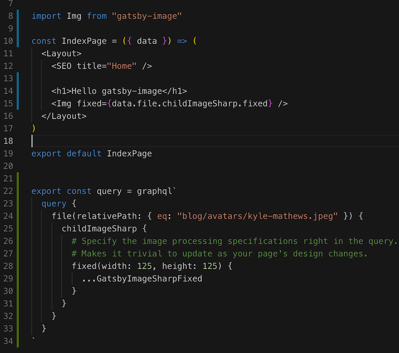

Gatsby has many features to win the developers' love and prevails over other mainstream static site generators. One of those features is [gatsby-image](https://www.gatsbyjs.org/packages/gatsby-image/) component. It solved the image optimization problem with the specified dimention scope you defined, progressively and responsively presenting to the webpage gives user a comfortable browsing experience.


## Steps to use gatsby-image

Like the official doc said, there are three steps needed to implement a gatsby image in Gatsby website:

- install [gatsby-image](https://github.com/gatsbyjs/gatsby/tree/master/packages/gatsby-image) component and two other build dependency plugins: [gatsby-transformer-sharp](https://www.gatsbyjs.org/packages/gatsby-transformer-sharp/) and [gatsby-plugin-sharp](https://www.gatsbyjs.org/packages/gatsby-plugin-sharp/)
- define image source directory in gatsby-source-filesystem plugin as well as above two plugin in `gatsby-config.js` plugins section
- import `gatsby-image` component to your gatsby page component and declare a image tag/instance with a `fixed` or `fluid` property whose value derived from graphql query.

In the step 2, you tell the Gatsby build tool, where to find the `root` directory of all the image files. Just like the doc example, the root directory here is `src/images/` of current Gatsby project:

```
{
  resolve: `gatsby-source-filesystem`,
  options: {
    name: `images`,
    path: path.join(__dirname, `src`, `images`),
  },
},
```

In the step 3, you tell gatsby-image component instance where to get the file: graphql query result. 

```
export const query = graphql`
  query {
    file(relativePath: { eq: "blog/avatars/kyle-mathews.jpeg" }) {
      childImageSharp {
        # Specify the image processing specifications right in the query.
        # Makes it trivial to update as your page's design changes.
        fixed(width: 125, height: 125) {
          ...GatsbyImageSharpFixed
        }
      }
    }
  }
`
```

## Which direcory to put image?


After seeing this graphql code snippet, you may wonder where's the `blog/avatars/kyle-mathews.jpeg`? Is it under project root or src/images? let's take a test from a blank gatsby project.


create gatsby project:

```
$ gatsby new using-image-in-gatsby
```

place kyle-mathews.jpeg image under `src/images/blog/avatars/`.


replace original index.js content with the following code:



> Note: Dont forget the `data` property in IndexPage properties.


Now, we can start the websit without the need to modify other stuff:

```
$ gatsby develop
```

Visit the `http://localhost:8000/` in your browser, you'll see the correct result.


This experiment verified our speculation, that is:

> gatsy-image/graphql query using relative path under the path defined in gatsby-source-filesystem as query condition!


## How about dynamic image source value?

Above example use static value `blog/avatars/kyle-mathews.jpeg` to query in graphql expression. Then, what if the query condition is from markdown file meta data?

Offical doc about [Working witg image in Markdown posts and pages](https://www.gatsbyjs.org/docs/working-with-images-in-markdown/) told us the placing the featuredImage in the same position of markdown file:

file structure:

    ├── src
      ├── pages
        ├── example-post.md
        ├── awesome-image.png


example-post.md:

```
---
title: My Amazing Post
featuredImage: ./awesome-image.png
---

Content goes here!
```

In this solution, it works though, but, if you have many posts which include many images in each post, the directory struture will grow big dramatically and end up with chaos.

How to restructure the images path in a reasonable way?

- Step one: deine a new content source in `gatsby-config.js`


```
plugins: [
    {
      resolve: `gatsby-source-filesystem`,
      options: {
        path: `${__dirname}/content`,
        name: `content`,
      },
    },
    ...
]    
```

- Step two: place all the images under `content/assets`

> seperate image files and .md files to different folder


    ├── content
      ├── posts
        ├── example-post.md
        ├── ....md
      ├── assets
          ├── fantastic-image.png
          ├── awesome-image.png
          |── ...
    ├── src


- Step three: reference the image using relative path in markdown file metadata.

example-post.md:
```
---
title: My Amazing Post
featuredImage: ../assets/awesome-image.png
---

Business intro is missing...
```

## How to use html img tag in a Gatsby application

In a normal web application, html img element can use relative or absolute path to assign `src` property. We use image in a native and static way like [the official doc](https://www.gatsbyjs.org/docs/static-folder/) said, place image under `static` folder, display image in webpage as we expected. But, when we build and deploy the gatsby site the [GitHub Pages](https://pages.github.com/), visit it under an URL pattern like this:

https://username.github.io/your-gatsby-website/


The images declared by img tag broken all!

Although all the `gatsby-image`s built by `$ gatsby build --prefx-paths` works, but those native imgs dont' work.

What's the solution?

- One solution is refactor all the `img`s to `gatsby-image` components
- Another solution is add context prefix the img `src` property.

For example:

```

```

`ueofcweb` is the github project name, `images/project-home.jpg` is actually under `ueofcweb/static`.

If you're refactoring a traditional website which use a large amount of img tags, the second option would be a cheap option. My production [officail site](https://github.com/runbytech/ueofcweb) is migrated from bootstrap/jquey stack, while I was adding it to the [Gatsby showcase](https://www.gatsbyjs.org/showcase/), I spend hours to figure out that the second approach is the best way to me.


Gatsby image is the best responsive image solution which I have met. It frees you from the tedious optimization work in the build phase, add good performance and excellent user experience to your website. It deserves you to spend time to delve into and use proficientlly.

Last note I can give in this post is:

```
Do not include folders under static folder, it's a BAD practice ending up with build error `childImageSharp' of null.
```